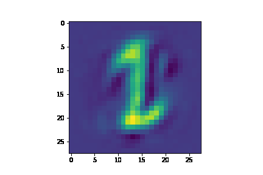
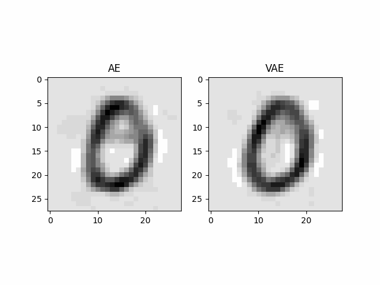
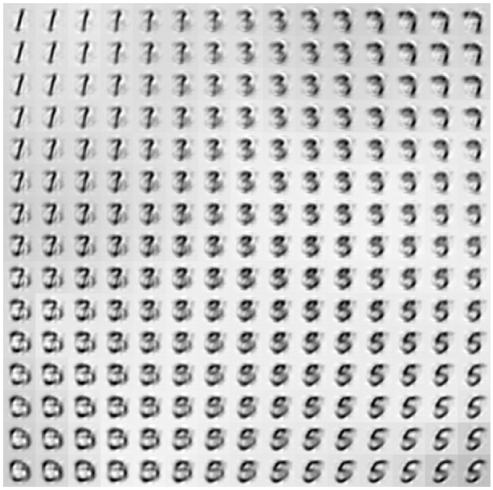
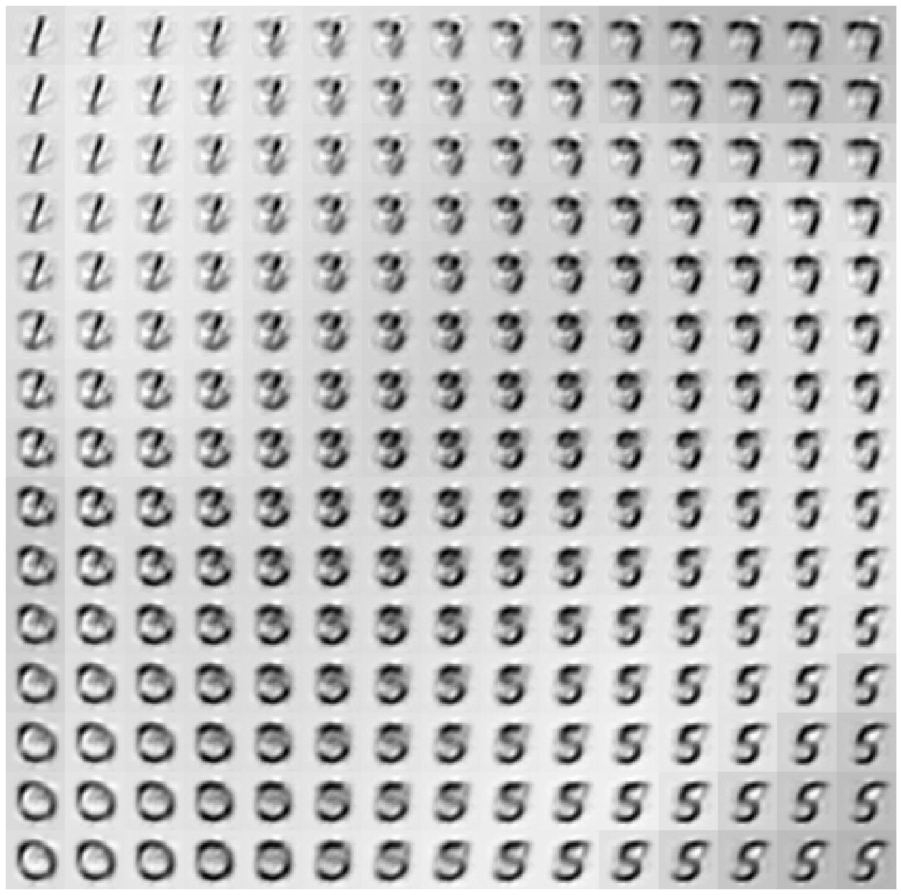

### Latent Space Visualizations of Generative Models

---

The repository visualizes the latent spaces that are generated using an Autoencoder and a Variational Autoencoder.
In order to do this for both the AE and the VAE we pick either a latent representation of an Image or a sample from the latent distribution respectively and decode it to visualize the generated image.
We can pick <b>two</b> of these images, and then interpolate the points in the latent between them to obtain a smooth transition between the two images.

Here is what an Autoencoder will generate for the MNIST dataset (with interpolations in the latent between one and 5):

 

A side by side comparison of the latent variables shows the advantages of VAE's giving a more smooth transition between the images.
Here is the visualization of the VAE for the same dataset:

Showing below is the grid of the VAE ,followed by the AE's grid ,notice that the VAE gives more readable results at the interpolation points ,showcasing it's usability for generative AI related tasks.

